# Twin-Boiler Coal Power Plant Simulator

A physically-based, real-time **operator training simulator** for a 660 MWe coal-fired
power station with **two boilers feeding one turbine-generator**. It runs the unit through
the **complete plant lifecycle — cold start-up, loading, on-load operation, fault
handling and normal shut-down —** and renders the whole station in interactive 3D.

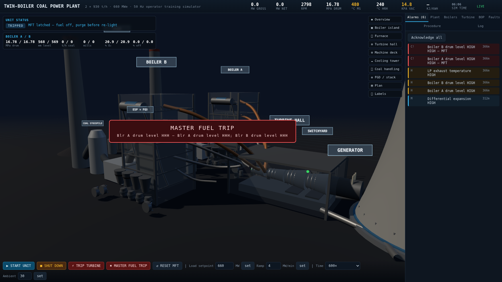

---

## Contents

* [What it simulates](#what-it-simulates)
* [Quick start](#quick-start)
* [Installation on Ubuntu Server](#installation-on-ubuntu-server)
* [Operating the simulator](#operating-the-simulator)
* [Fault catalogue](#fault-catalogue)
* [Hidden administration console](#hidden-administration-console)
* [Screenshots](#screenshots)
* [Model notes and validation](#model-notes-and-validation)
* [Architecture](#architecture)
* [Licence](#licence)

---

## Design point

| Parameter | Value |
|---|---|
| Net / gross output | 618 / 660 MWe, 50 Hz, 3 000 rpm |
| Configuration | 2 × 930 t/h boilers → 1 turbine-generator |
| Main steam | 16.7 MPa(a) / 538 °C |
| Reheat | 3.90 MPa in / 538 °C out, 790 t/h per boiler |
| Condenser | 9.5 kPa(a), 2-pass, circulating water |
| Cooling | hyperbolic natural-draft tower, 9.8 K range, 7.5 K approach |
| Coal | sub-bituminous, 20 000 kJ/kg LHV, 15 % moisture, 8.5 % ash |
| Mills | 4 per boiler (8 total), 16 burners per boiler |
| Flue gas | ESP (4 fields) → FGD absorber → 122 m stack |
| Auxiliary load | 42 MW at MCR |

---

## What it simulates

**Boiler island (×2)** — coal stockpile → conveyors → crushers → bunkers → 4 mills →
16 burners; forced-draft, induced-draft and primary-air fans; furnace (well-stirred
radiant model solved for flame / furnace-exit gas temperature); water walls; steam drum
with swell and shrink; radiant platen superheater; convective superheater, reheater,
economiser and air preheater (ε-NTU cascade with two-sided flow correction);
two-stage attemperators; reheater emergency spray; start-up vent / HP-LP bypass;
soot blowing; slagging; ESP; FGD; ash and gypsum silos.

**Turbine-generator** — HP, IP and two LP cylinders on one shaft; first-stage-pressure
governor; speed and load controllers; isentropic stage expansions with part-speed
(velocity-ratio) efficiency; rotor inertia with stall torque and windage; turning gear;
jacking and lubricating oil; gland sealing; axial shift, eccentricity and differential
expansion; hydrogen-cooled generator with AVR.

**Balance of plant** — condenser with vacuum pumps and air ingress, circulating-water
pumps, cooling tower with plume, condensate pumps, deaerator, HP and LP heaters,
2 × 100 % boiler feed pumps, instrument and station air, auxiliary steam, DM water make-up.

**Control and protection** — three-element drum level control, superheater and reheater
temperature control, furnace draft control, boiler-follow coordinated control with
load runback, master fuel trip (MFT) and turbine trip interlocks with realistic
pick-up delays, and a full annunciator.

---

## Quick start

```bash
git clone https://github.com/mikeehendricks/TurbineCoalSimulator.git
cd TurbineCoalSimulator
npm install                    # express + ws only
npm install --no-save three@0.169.0 && node scripts/vendor.js
node server/server.js
# open http://localhost:8080
```

Three.js is vendored into `public/vendor/three/` so the simulator runs with **no
internet access**; it is deliberately *not* a runtime dependency of `package.json`.

---

## Installation on Ubuntu Server

Tested on **Ubuntu Server 20.04, 22.04, 24.04 and 25.04**.

```bash
git clone https://github.com/mikeehendricks/TurbineCoalSimulator.git
cd TurbineCoalSimulator
sudo ./install.sh
```

or, without cloning first (the installer clones the repository itself — run it
from a directory that is **not** a git checkout):

```bash
curl -fsSL https://raw.githubusercontent.com/mikeehendricks/TurbineCoalSimulator/main/install.sh -o install.sh
chmod +x install.sh
sudo ./install.sh
```

The installer:

1. installs the system libraries (git, build tools, Chromium runtime libs),
2. installs **Node.js 20 LTS** if the distro copy is older than 18,
3. creates an unprivileged `simulator` service account,
4. deploys the application to `/opt/turbine-coal-simulator`,
5. runs `npm install` and vendors Three.js,
6. writes `/opt/turbine-coal-simulator/.env`,
7. installs and enables the **systemd unit** `turbine-coal-simulator`,
8. grants the service account password-less `systemctl restart` (used by the
   admin **Update Now** button),
9. opens the port in `ufw` when it is active.

Environment overrides:

```bash
sudo APP_DIR=/srv/sim APP_USER=sim PORT=9090 ADMIN_PATH=/admin ./install.sh
```

**Ports and library names.** The installer resolves every system library to the
name that actually exists in your release's archive — Ubuntu 24.04/25.04 renamed
several of them to the `t64` ABI flavour (`libasound2` → `libasound2t64`,
`libatk1.0-0` → `libatk1.0-0t64`, `libcups2` → `libcups2t64`, …) and apt refuses
the old virtual names. The headless-browser libraries are optional: they are only
needed by the Puppeteer screenshot harness `tools/shots.js`, and a failure to
install them never aborts the installation.

If you choose a port **below 1024** (e.g. `PORT=80`), the service is granted
`CAP_NET_BIND_SERVICE`, because the unprivileged `simulator` account cannot
otherwise bind a privileged port. Any other hardening in the unit is unchanged.

Service control:

```bash
sudo systemctl status  turbine-coal-simulator
sudo journalctl -u turbine-coal-simulator -f
sudo systemctl restart turbine-coal-simulator
```

---

## Operating the simulator

| Control | Action |
|---|---|
| **START UNIT** | runs the automatic cold start-up sequence |
| **SHUT DOWN** | automatic unloading → turbine trip → firedown → post purge |
| **TRIP TURBINE** | manual turbine trip |
| **MASTER FUEL TRIP** | manual MFT |
| **RESET MFT** | resets the trip relays once the cause is cleared |
| **Load setpoint / ramp** | complete the loading once synchronised |
| **Time** | 1× … 600× real time |
| **Ambient** | air temperature (drives the cooling tower and condenser) |

### Cold start-up sequence

| Phase | What happens | Typical duration |
|---|---|---|
| `PRESTART` | lube oil, jacking oil, turning gear, CW and condensate pumps, vacuum pulled, drums filled, ESP and FGD in service | ≈ 5 min |
| `PURGE` | FD + ID fans at ≥ 30 % air, 5-minute furnace purge | 5 min |
| `LIGHTOFF` | oil ignitors, flame proving | 2 min |
| `PRESSURISING` | firing rate follows the start-up envelope; mills start once the furnace can ignite coal; start-up vent controls steam temperature | ≈ 2.5 h |
| `TURBINE_ROLL` | 200 rpm roll → 600 rpm soak → 1 800 rpm soak → 3 000 rpm soak | ≈ 1 h |
| `SYNCHRONISING` | AVR on auto, breaker closed | 30 s |
| `LOADING` | 5 % initial load soak, then ramp with load runback | operator-managed |

Measured on this build (automatic sequence, 600× time acceleration):

| Milestone | Simulated time |
|---|---|
| Pre-start complete | 5 min |
| Purge / light-off | 12 min |
| Pressure raising complete (8 MPa, 538 °C) | 200 min |
| Turbine rolled to 3 000 rpm | 265 min |
| Synchronised, initial load | 285 min |
| Automatic loading complete (≈ 15 % load) | 312 min |

The operator then completes the loading with the load setpoint and ramp rate
(6 MW/min is a comfortable figure); the unit settles at **≈ 500 MW gross /
450 MW net** with the present calibration. Loading beyond that is a genuine
boiler-turbine balancing exercise — the drum pressure runs up against the
safety valves and the coordinated controller backs the firing off, which is
exactly the kind of operating problem the simulator exists to teach.
Time acceleration up to 600× keeps the integration stable (sub-stepped at
0.5 s of simulated time).

---

## Fault catalogue

34 faults can be injected live from the **Faults** tab. Each one carries its cause,
observable symptoms and the recommended operator actions.

**Boiler** — boiler tube leak · superheater tube leak · mill blockage · mill fire ·
loss of flame · air-heater fire · slagging · drum level high · economiser leak

**Air & gas** — ID fan trip · FD fan trip · PA fan trip · ESP failure · FGD trip

**Feedwater** — BFP trip · BFP cavitation · condenser tube leak

**Turbine** — bearing vibration · lube-oil leak · loss of vacuum · CW pump trip ·
gland-seal loss · overspeed test failure · thrust-bearing wear · bearing wear

**Generator** — stator overheating · hydrogen leak · AVR failure · grid fault

**Coal & ash** — coal feeder trip · wet coal · ash blockage · conveyor trip ·
instrument-air loss

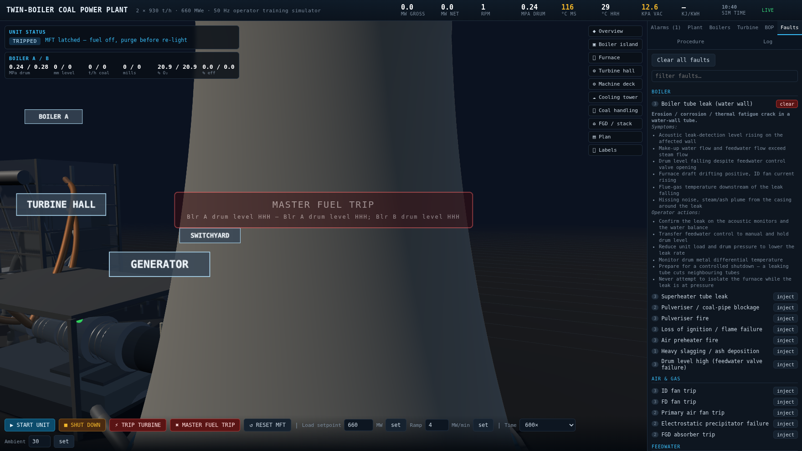

---

## Hidden administration console

Served only at **`/admin`**. It is *not* linked from the simulator, is excluded from
`robots.txt`, and is sent with `no-store` and `X-Robots-Tag: noindex`.

* **One-time registration.** The first visit offers registration. Once an
  administrator exists the server permanently rejects further registrations and the
  page shows a sign-in form instead.
* **Live visitor list** — every session that has opened the simulator, with its
  **public WAN IP** and the **physical location** (country, region, city, postcode,
  coordinates, ISP/organisation) resolved from that address.
* **Update system** — the version and latest commit are read from *this GitHub
  repository*. The **Update Now** button is rendered **only when an update is
  actually available**; while it runs the log streams to the page, and **when the
  update-completed message appears the page reloads itself**.

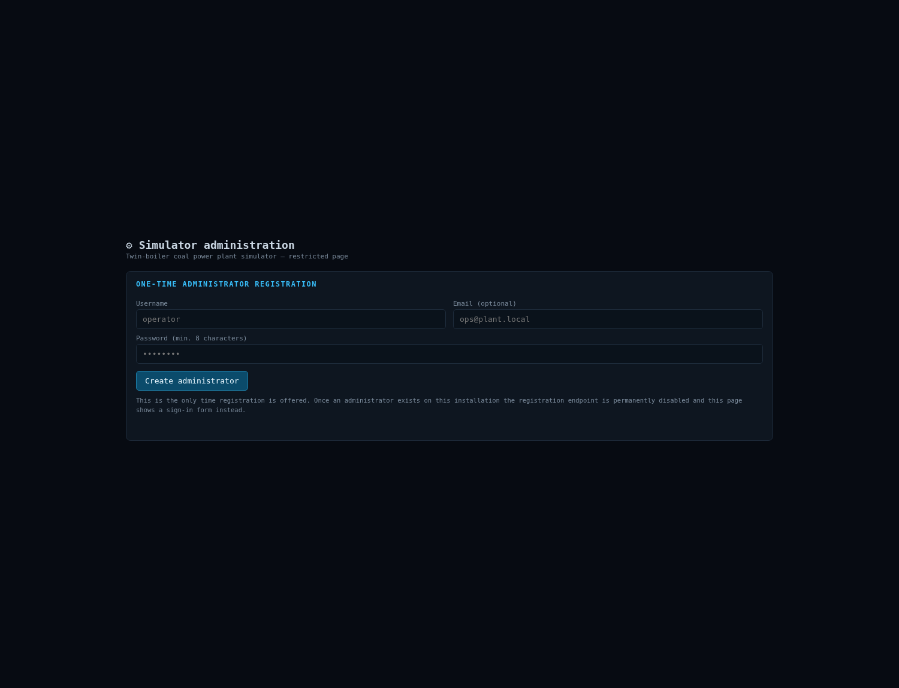

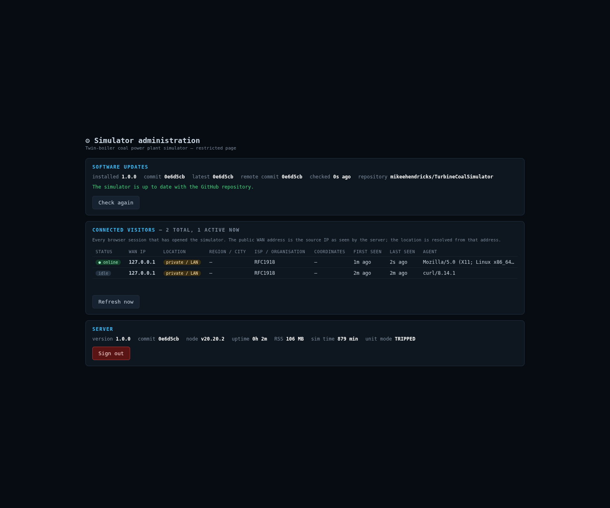

---

## Screenshots

| | |
|---|---|
| 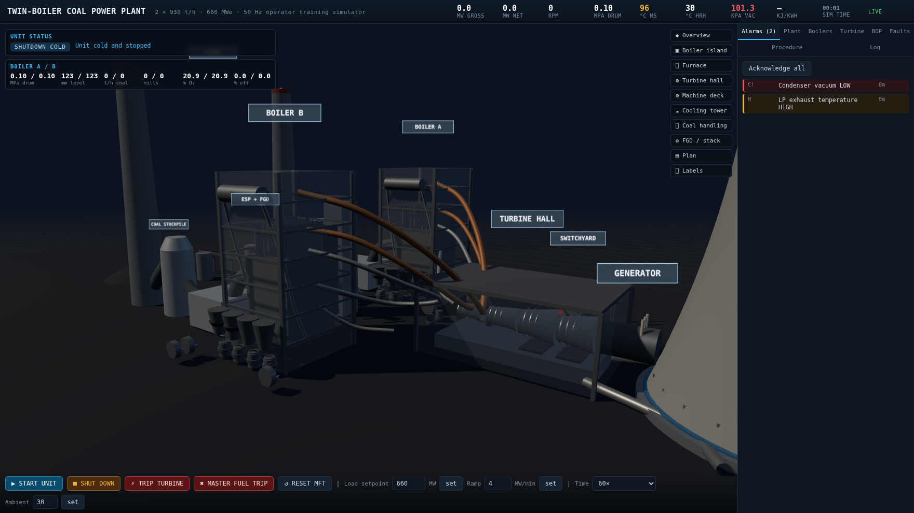 <br> Cold unit before start-up | 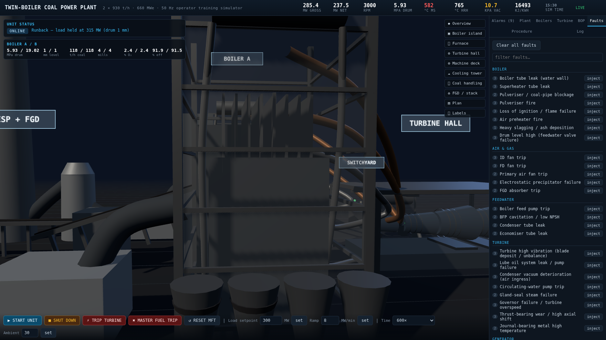 <br> Boiler island — mills, fans, drums |
| 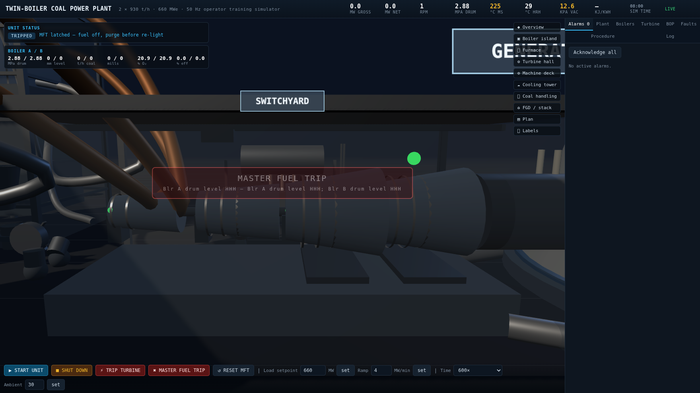 <br> Turbine hall — HP/IP/LP and generator | 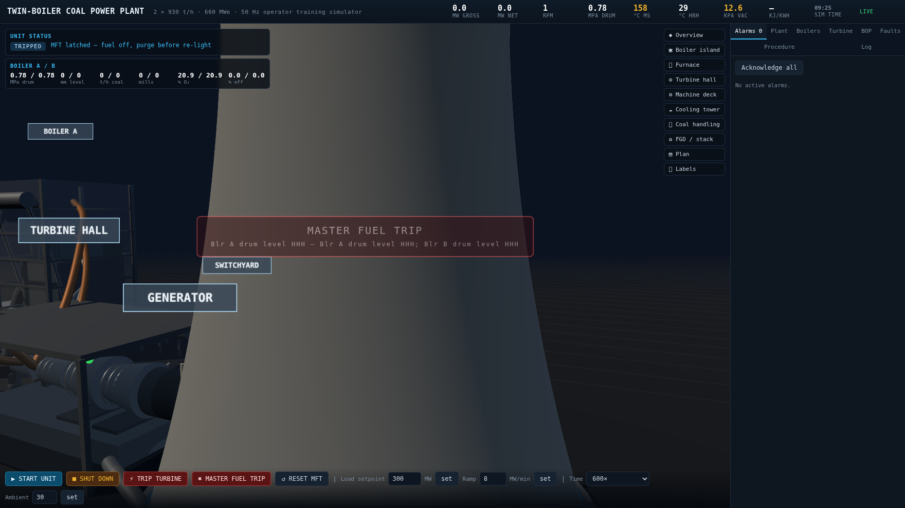 <br> Natural-draft cooling tower with plume |
| 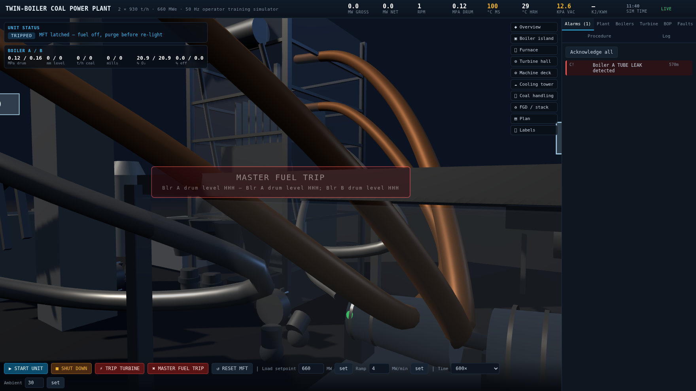 <br> Annunciator and furnace view | 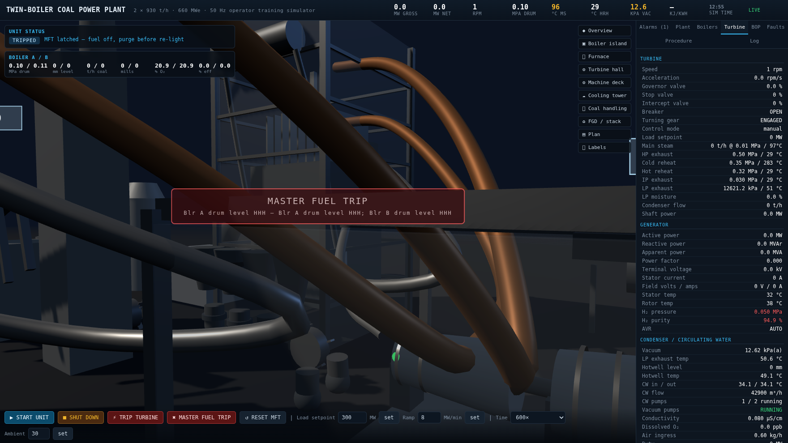 <br> Turbine supervisory instrumentation |
| 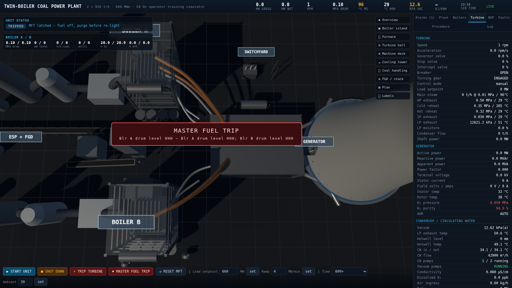 <br> Station plan |  <br> Fault injection with operator actions |

---

## Model notes and validation

* **Steam properties** — a purpose-built IAPWS-style package (`server/sim/steam.js`)
  with saturation tables, superheated enthalpy/entropy by quadrature, compressed
  liquid, and isentropic expansion including the wet region. Validated against
  published steam tables to better than **0.5 %** across the operating band
  (16.7 MPa / 538 °C → 3379.7 kJ/kg vs 3395 reference; 4.0 MPa / 538 °C exact).
* **Furnace** — single well-stirred reactor: `Q_fuel = ṁ·c_p·(T_f − T_air) + ΣK(T_f⁴ − T_sink⁴)`.
  Solving for the flame temperature makes the model behave correctly at low firing —
  the flame temperature collapses towards the wall temperature instead of staying at
  the adiabatic value — and reproduces the rise of furnace-exit gas temperature with
  load (≈ 640 °C at light-off, ≈ 1 250 °C at MCR).
* **Convection banks** — ε-NTU with the conductance falling on *both* sides as flows
  fall (`1/h_g ∝ ṁ_g^-0.65` in series with `1/h_s ∝ ṁ_s^-0.8`). Without the fluid-side
  term the superheater unphysically reaches gas temperature at low load.
* **Calibration** — `server/sim/heat.js` holds the empirical coefficients, fitted by
  `tools/tune.js` against the plant heat balance. At the MCR design point the model
  reproduces: main steam 538 °C, hot reheat 538 °C, furnace exit 1 250 °C, stack
  ≈ 165 °C, hot air ≈ 330 °C, boiler efficiency ≈ 86–89 %.
  Known limitations on the current build: the hot reheat temperature settles low
  (≈ 400 °C) at high load because the reheater gas-bypass characteristic is
  coarse, and the achieved gross heat rate (≈ 13 000 kJ/kWh) is above the design
  figure because the cycle runs at a higher throttle pressure and poorer vacuum
  than the design point.
* **Rotor dynamics** — `J = 38 000 kg·m²` with a velocity-ratio wheel efficiency that
  keeps the developed torque finite at standstill, so run-up from the turning gear to
  3 000 rpm is continuous and follows the soak programme.
* **Furnace draft** — the furnace pressure is the integral of the FD/ID flow
  imbalance, so losing either fan drives the draft to the trip limits in about two
  seconds, as on a real boiler.

Validation harnesses: `node tools/calib.js` (steady-state heat balance),
`node tools/tune.js` (coefficient fitting), `node tools/simcheck.js` (start-up run),
`node tools/shots.js` (README screenshots).

---

## Architecture

```
server/
  sim/steam.js        water/steam properties
  sim/constants.js    design point, limits, start-up envelope, run-up programme
  sim/heat.js         fitted boiler heat-transfer coefficients
  sim/plant.js        Boiler / TurbineGenerator / BalanceOfPlant dynamic models
  sim/faults.js       34-entry fault catalogue with cause, symptoms and actions
  sim/engine.js       sequencer, MFT/turbine-trip protection, alarms, snapshot
  server.js           Express + WebSocket + REST + hidden admin API
public/
  index.html          operator HMI
  js/scene.js         procedural 3D station model (Three.js)
  js/app.js           HMI wiring, trends, alarms, faults
  admin.html          hidden admin console
  js/admin.js         admin logic
  vendor/three/       vendored Three.js r169
scripts/
  update.sh           git pull + npm install, run by "Update Now"
  vendor.js           copies Three.js into public/vendor
install.sh            Ubuntu Server installer + systemd unit
```

The engine ticks at 5 Hz and sub-steps the integration so that time acceleration up
to 600× stays numerically stable (≈ 18 000× real time on one core).

---

## Licence

Provided as-is for operator training and education.

## Updating

The simulator checks GitHub for a newer commit and can update itself. On an
installed server, `tcs-update` is on the PATH:

```bash
tcs-update status              # check GitHub for a newer build (read-only)
tcs-update apply --restart     # install it and restart the service
tcs-update log                 # tail the service journal
```

`tcs-update` is installed to `/usr/local/bin` by the installer as a symlink into
the deploy directory, so it keeps working across updates. It wraps the same
Node entry point, which is also usable directly:

```bash
node tools/update.js status
node tools/update.js apply --restart
```

`status` is read-only and exits with code 1 when an update is available, so it
can be driven from cron. `apply` is the same operation the **Update Now** button
on the hidden admin page spawns: it fetches, resets the working copy to
`origin/main`, reinstalls dependencies and rebuilds the vendored browser
libraries — local edits to tracked files are discarded by design, so the install
always matches the repository.

Environment overrides: `GIT_BRANCH` (default `main`), `UPDATE_SERVICE`
(default `turbine-coal-simulator`), `APP_DIR`.

### Authenticating git (maintainers)

Pushing needs a fine-grained personal access token with **Contents: Read and
write** on this repository. Keep it in `~/.tcsim/token` (mode `0600`) — outside
the repository, because the security suite scans the tree for credentials — and
run:

```bash
bash tools/git-auth.sh            # install credentials, point origin at the plain https URL
bash tools/git-auth.sh --check    # confirm the token still works
```

The token is placed in the git credential store, never in `.git/config`, so
`git remote -v` is safe to show and no credential can be committed by accident.

## Testing

Four automated suites ship with the simulator. Run them all and regenerate the
executive report with:

```bash
npm test                        # all four suites, then docs/executive-test-report.html
node tools/run-tests.js --quick  # skip the slow physics suite
node tools/test-sim.js           # physics & plant behaviour  (~12 min)
node tools/test-api.js           # HTTP / WebSocket API       (~5 s)
node tools/test-ui.js            # usability, tutorial, sound (~7 min, needs the server on :8080)
node tools/test-security.js      # security & vulnerabilities (~3 s)
node tools/loadtest.js --target=660 --ramp=4    # load-ramp harness
```

`tools/test-ui.js` uses Puppeteer, which is not a runtime dependency:

```bash
npm install puppeteer --no-save
```

The consolidated result — coverage, per-check evidence, defects found and fixed,
open findings and recommendations — is written to
**`docs/executive-test-report.html`** (and `docs/EXECUTIVE-TEST-REPORT.md`).

